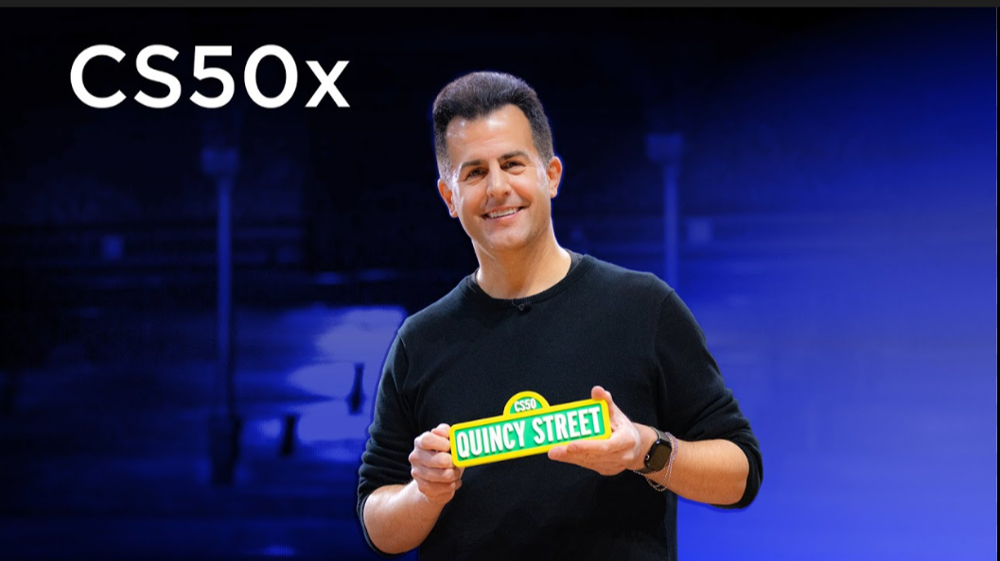

<h1 >CS50x introduction to computer science</h1>

This is CS50, Harvard University’s introduction to the intellectual enterprises of computer science and the art of programming, for concentrators and non-concentrators alike, with or without prior programming experience. (Two thirds of CS50 students have never taken CS before.) This course teaches you how to solve problems, both with and without code, with an emphasis on correctness, design, and style. Topics include computational thinking, abstraction, algorithms, data structures, and computer science more generally. Problem sets inspired by the arts, humanities, social sciences, and sciences. More than teach you how to program in one language, this course teaches you how to program fundamentally and how to teach yourself new languages ultimately. The course starts with a traditional but omnipresent language called C that underlies today’s newer languages, via which you’ll learn not only about functions, variables, conditionals, loops, and more, but also about how computers themselves work underneath the hood, memory and all. The course then transitions to Python, a higher-level language that you’ll understand all the more because of C. Toward term’s end, the course introduces SQL, via which you can store data in databases, along with HTML, CSS, and JavaScript, via which you can create web and mobile apps alike. Course culminates in a final project.

**Course Link:** <https://cs50.harvard.edu/x/>

## instructions

1. Open the [course link](https://cs50.harvard.edu/x/) given above. Click on [weeks](https://cs50.harvard.edu/x/weeks/).
3. Work through all the course weeks as given in the link above. Watch the Lecture videos and shorts, and then solve the problem sets.
4. You shouldn't skip the problem sets.
7. Each problem set come with a script and instructions to check your solution. And if they are correct submit them.
9. If you are stuck somewhere, feel free to ask questions. You can join the OSSU chat for this course here: <https://discord.gg/jvchSm9> or in the official [CS50](https://discord.com/channels/393846237255696385/@home) server <https://discord.gg/jvchSm9>.

## Notes

1. You will get a certaficat after doing all the problem sets and the final project. They are two types of certaficate verfiyed one from edx itself but you should pay for it and the free one. Remember its not about vertaficates its about what did you learn from it.
2. Don't skip any week every week is important.
